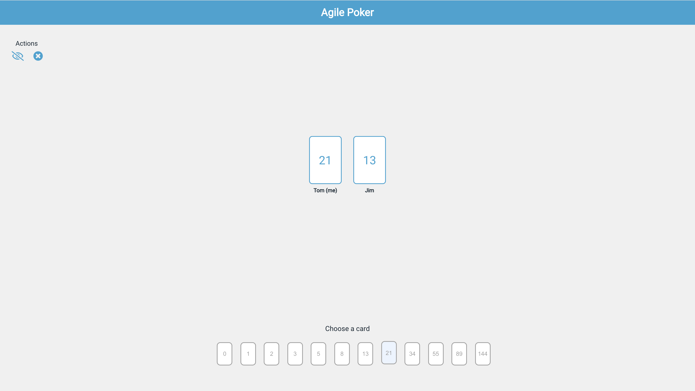

# ♠️ Agile Poker ♠️
A web application to aid estimating the costing of creating projects in teams using an approach called planning poker.

## ⚙️ Setup
1. Install the python dependencies (in `requirements.txt`)
2. Replace the protocol for the `io.connect` constructor method if `https` is needed (~`poker.html:345`)
3. Run the webserver using `python3 webserver.py`

**Note: If deploying the webapp, a WSGI server is needed.** Read more [here](https://flask.palletsprojects.com/en/2.0.x/deploying/index.html)

## 🎓 Licence
This software is released under the [GNU AGPLv3](LICENSE) licence

## 👨 The Author
[Please click here to see more of my work!](https://tomstowe.co.uk)
